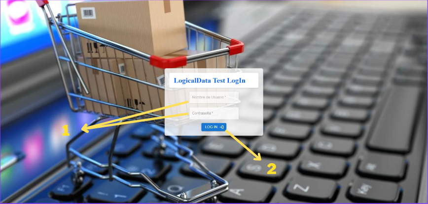
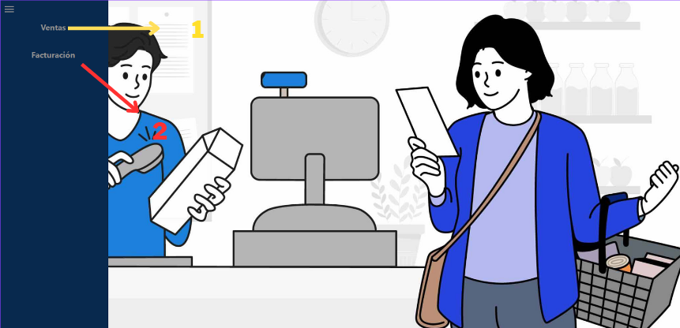
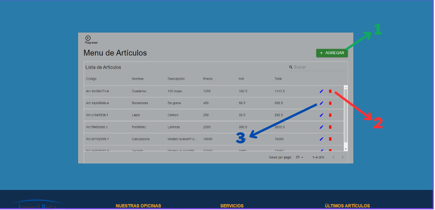
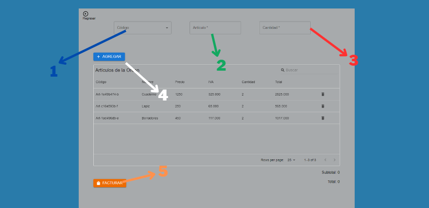
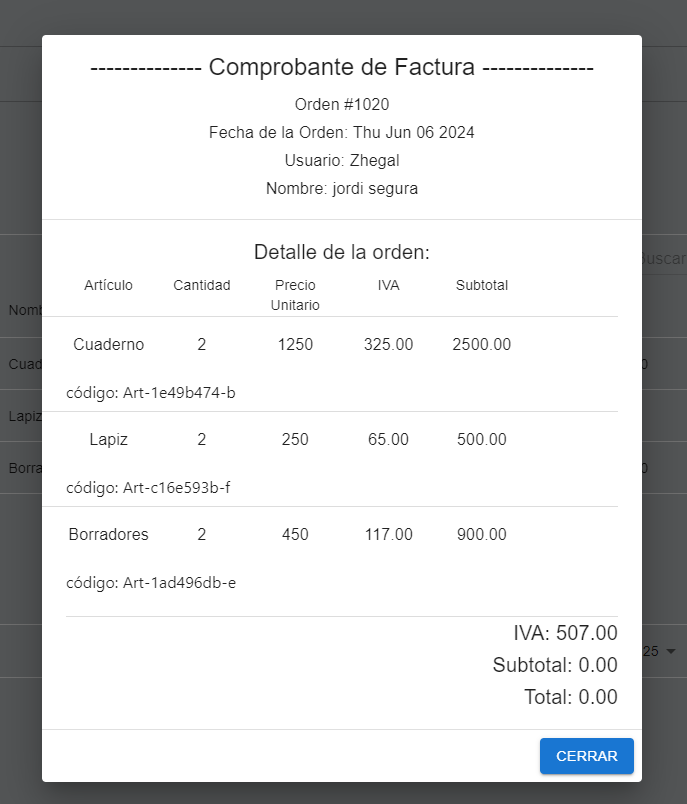

La aplicacion fue creada en React utilizando Typescript. 

Para manejar las solicitudes a la API, se utiliza Axios, una biblioteca que simplifica la realización de peticiones HTTP. Además, la gestión del estado de la aplicación se realiza mediante Zustand, una biblioteca ligera y flexible que facilita el manejo y actualización del estado de forma eficiente. Esta combinación de tecnologías permite crear una aplicación web robusta y de alto rendimiento, con una gestión del estado centralizada y una comunicación eficiente con el backend.

###Manual de instalación

1. Abrir el proyecto, abrir una terminal desde la carpeta principal. 

2. Es importante verificar que los servicios estén configurados con el puerto correcto para la URL base de la API. Los servicios en la aplicación dependen de una variable de entorno para determinar el puerto en el que la API está funcionando. Esta variable de entorno se define en el archivo .env. Si la API está operando en un puerto diferente al que está actualmente configurado en el archivo .env, es necesario modificar este archivo para reflejar el puerto correcto. Esto asegura que la aplicación pueda comunicarse correctamente con la API, evitando errores de conexión y garantizando el correcto funcionamiento del sistema.
            **** La variable de entorno que se encuentra en el archivo .env es: REACT_APP_API_PORT_BACKEND_LOGICAL_DATA=7105
            -> Aqui cambiaremos el puerto por el puerto que nos genere el API

3. Instalar las dependencias con el comando "npm install" desde la terminal abierta anteriormente.

4. Por último arrancar la aplicación con el comando "npm start" en la misma terminal. (Esto puede tardar dependiendo del equipo)

###Manual de uso

Al arrancar la aplicación se presentará la pagina de LogIn, aca se deberán agregar las credenciales:

 

  

 
 

El elemento 1 son los inputs donde es necesario insertar las credenciales respectivamente como se solicita.
El elemento 2 es el boton encargado de autenticar al usuario y seguidamente redirigirlo al dashboard.

 
 

  

 
 

El elemento 1 es el link que nos redirige hacia la pantalla de administración de artículos.
El elemento 2 es el link que nos redirige hacia la pantalla de administración de factura.

 
 
Pantalla Ventas

  

 
 

El elemento 1 es el boton que nos abre el modal para poder agregar un artículo al sistema al insertar los datos del artículo y guardar. 
El elemento 2 es el boton que nos ayuda a eliminar un artículo del sistema. 
El elemento 3 es el boton que nos abre un modal y este nos ayuda a editar un artículo en el sistema. 

 
 
Pantalla Facturación

  

 
 
El elemento 1 es un selector que nos abre las opciones de los códigos de los artículos a elegir, al seleccionarlo los datos de este se cargan para ser agregado. 
El elemento 2 es el que nos muestra el nombre del artículo seleccionado. 
El elemento 3 es el input donde se espera que el usuario inserte la cantidad de artículos que desea agregar a la orden. 
El elemento 4 es el boton que nos ayuda a agregar el artículo seleccionado y con la cantidad insertada. 
El elemento 5 es el encargado de procesar la orden, agregarla al sistema y mostrar seguidamente la factura, que es la siguiente:

 
 

  

 
 

